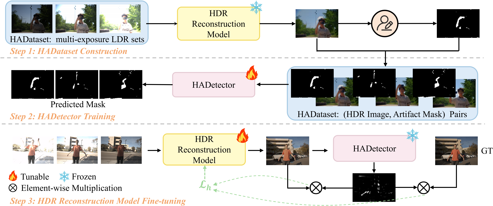
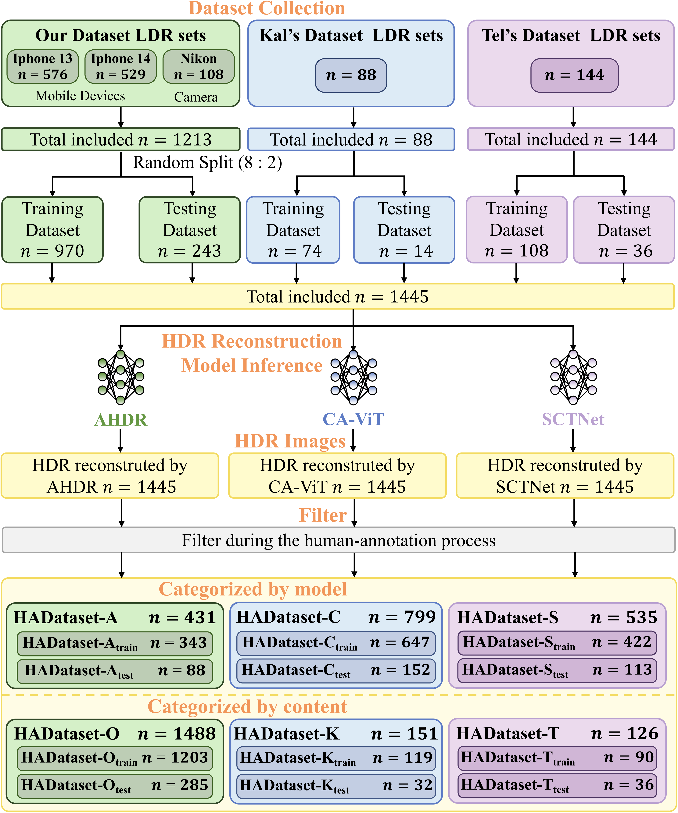

# Rethinking Artifact Mitigation in HDR Reconstruction: From Detection to Optimization
#### IEEE Transactions on Image Processing (TIP), 2025

[Xinyue Li](https://xinyueliii.github.io/)<sup>1</sup>,  [Zhangkai Ni](https://eezkni.github.io/)<sup>1</sup>, [Hang Wu](https://wuhang03.github.io/)<sup>1</sup>, [Wenhan Yang](https://flyywh.github.io/)<sup>2</sup>, [Hanli Wang](https://mic.tongji.edu.cn/51/91/c9778a86417/page.htm)<sup>1</sup>, [Lianghua He](https://dblp.org/pid/24/2365.html)<sup>1</sup>, [Sam Kwong](https://scholar.google.com/citations?user=_PVI6EAAAAAJ&hl=zh-CN)<sup>3</sup>

<sup>1</sup>Tongji University, <sup>2</sup>Peng Cheng Laboratory, <sup>3</sup>Lingnan University

This repository provides the official implementation for the paper "Rethinking Artifact Mitigation in HDR Reconstruction: From Detection to Optimization", IEEE Transactions on Image Processing (TIP), 2025. 
[Paper-official](https://ieeexplore.ieee.org/document/11301923) 



## About HADetector

Artifact remains a long-standing challenge in HDR reconstruction. 
Existing methods focus on model designs for artifact mitigation but ignore explicit detection and suppression strategies.
Because artifact lacks clear boundaries, distinct shapes, and semantic consistency, and there is no existing dedicated dataset for HDR artifact, progress in direct artifact detection and recovery is impeded. 
To bridge the gap, we propose a unified HDR reconstruction framework that integrates artifact detection and model optimization.  
Firstly, we build the first HDR artifact dataset (HADataset), comprising 1,213 diverse multi-exposure Low Dynamic Range (LDR) image sets and 1,765 HDR image pairs with per-pixel artifact annotations.  
Secondly, we develop an effective HDR artifact detector (HADetector), a robust artifact detection model capable of accurately localizing HDR reconstruction artifact. 
HADetector plays two pivotal roles: (1) enhancing existing HDR reconstruction models through fine-tuning, and (2) serving as a non-reference image quality assessment (NR-IQA) metric, the Artifact Score (AS), which aligns closely with human visual perception for reliable quality evaluation.

**TL;DR:** This work addresses the persistent challenge of artifacts in HDR reconstruction. We introduce the first HDR artifact dataset (HADataset) with 1,213 LDR sets and 1,765 annotated HDR pairs, alongside HADetector—a novel detector that enables artifact-aware model fine-tuning and serves as a perception-aligned no-reference quality metric.

## HADataset Collection Pipeline


## HADataset Statistics


## Experimental Results

### Quantitative experimental results on HADataset

HADetector's artifact detection performance on HADataset is shown below. We conduct experiments on six subsets of HADataset, namely HADataset-O, HADataset-K, HADataset-T, HADataset-A, HADataset-C, and HADataset-S.

<div align="center">  </div>

### Quantitative experimental results on Kalantari’s dataset

The performance of the proposed fine-tuning pipeline using HADetector is shown below. We used frozen variants of HADetector (including HADetector-O, HADetector-K, and HADetector-T) to fine-tune three representative models, i.e., AHDR, CA-ViT, and SCTNet.

<div align="center">  </div>

## Environment setup

To start, we prefer creating the environment using conda:
```sh
conda create -n hadetector python=3.12.12
conda activate hadetector
pip install -r requirements.txt
```

[Pytorch](https://pytorch.org/) installation is machine dependent, please install the correct version for your machine.

<details>
  <summary> Dependencies (click to expand) </summary>

  - `PyTorch`, `numpy`: main computation.
  - `tqdm`: progress bar.
  - `opencv-python`,`scikit-image`: image processing.
  - `imageio`: images I/O.
  - `einops`: torch tensor shaping with pretty api.
</details>

## Getting the dataset

The HADataset is available on Hugging Face 🤗

[](https://huggingface.co/datasets/Xinyueliii/HADataset)

The HADataset consists of two parts:

- HADataset-LDRsets-release
- HADataset-HDRArtifactDetection-release

## Directory structure for HADataset-LDRsets-release

This part includes 1,216 LDR sets captured by us for HDR inference. It contains 970 sets in the Training set and 243 sets in the Test set.

<details>
  <summary> (click to expand;) </summary>

    HADataset-LDRsets-release
    └── data
        ├── Training (970 sets)
        |   ├── 13_0002
        |   |   ├── 1.tif
        |   |   ├── 2.tif
        |   |   ├── 3.tif
        |   |   └── exposure.txt
        |   ...
        |   └── Nikon_0108
        |       ├── 1.tif
        |       ├── 2.tif
        |       ├── 3.tif
        |       └── exposure.txt
        └── Test (243 sets)
            ├── 13_0001
            |   ├── 1.tif
            |   ├── 2.tif
            |   ├── 3.tif
            |   └── exposure.txt
            ...
            └── Nikon_0079
                ├── 1.tif
                ├── 2.tif
                ├── 3.tif
                └── exposure.txt


</details>


## Directory structure for HADataset-HDRArtifactDetection-release

This part includes 6 subsets of HADataset for HDR artifact detection. Specifically, considering artifacts originating from different datasets (i.e., [Kalantari's dataset](https://cseweb.ucsd.edu/~viscomp/projects/SIG17HDR/), Our dataset, and [Tel's dataset](https://drive.google.com/drive/folders/1CtvUxgFRkS56do_Hea2QC7ztzglGfrlB)) and artifacts generated by different models (i.e., AHDR, CA-ViT, and SCTNet), we categorize the HADataset into two views:

- Content Perspective (3 subsets):
  - HADataset-content-Kal
  - HADataset-content-Ours
  - HADataset-content-Tel

- Model Perspective (3 subsets):
  - HADataset-content-AHDR
  - HADataset-content-CaViT
  - HADataset-content-SCTNet

<details>
  <summary> (click to expand;) </summary>

    HADataset-HDRArtifactDetection-release
    └── HADataset-content-Kal
        ├── Training
        |   ├── GT (119 images)
        |   |   ├── Kal_AHDR_001.png
        |   |   ...
        |   ├── Tp (119 images)
        |   |   ├── Kal_AHDR_001.png
        |   |   ...
        ├── Test
        |   ├── GT (30 images)
        |   |   ├── Kaltest_Trans_010.png
        |   |   ...
        |   └── Tp (30 images)
        |       ├── Kaltest_Trans_010.png
        |       ...
        |
        HADataset-content-Ours
        ├── Training
        |   ├── GT (1203 images)
        |   |   ├── 13_AHDR_0003.png
        |   |   ...
        |   ├── Tp (1203 images)
        |   |   ├── 13_AHDR_0003.png
        |   |   ...
        ├── Test
        |   ├── GT (285 images)
        |   |   ├── 13_AHDR_0288.png
        |   |   ...
        |   └── Tp (285 images)
        |       ├── 13_AHDR_0288.png
        |       ...
        |
        HADataset-content-Tel
        ├── Training
        |   ├── GT (90 images)
        |   |   ├── Tel_AHDR_scene_0050_1.png
        |   |   ...
        |   ├── Tp (90 images)
        |   |   ├── Tel_AHDR_scene_0050_1.png
        |   |   ...
        ├── Test
        |   ├── GT (36 images)
        |   |   ├── Tel_AHDR_scene_0007_2.png
        |   |   ...
        |   └── Tp (36 images)
        |       ├── Tel_AHDR_scene_0007_2.png
        |       ...
        |
        HADataset-content-AHDR
        ├── Training
        |   ├── GT (343 images)
        |   |   ├── 13_AHDR_0003.png
        |   |   ...
        |   ├── Tp (343 images)
        |   |   ├── 13_AHDR_0003.png
        |   |   ...
        ├── Test
        |   ├── GT (88 images)
        |   |   ├── 13_AHDR_0245.png
        |   |   ...
        |   └── Tp (88 images)
        |       ├── 13_AHDR_0245.png
        |       ...
        |
        HADataset-content-CaViT
        ├── Training
        |   ├── GT (647 images)
        |   |   ├── 13_Trans_0149.png
        |   |   ...
        |   ├── Tp (647 images)
        |   |   ├── 13_Trans_0149.png
        |   |   ...
        ├── Test
        |   ├── GT (152 images)
        |   |   ├── 13_Trans_0014.png
        |   |   ...
        |   └── Tp (152 images)
        |       ├── 13_Trans_0014.png
        |       ...
        |
        HADataset-content-SCT
        ├── Training
        |   ├── GT (422 images)
        |   |   ├── 13_SCT_0063.png
        |   |   ...
        |   ├── Tp (422 images)
        |   |   ├── 13_SCT_0063.png
        |   |   ...
        ├── Test
            ├── GT (113 images)
            |   ├── 13_SCT_0001.png
            |   ...
            └── Tp (113 images)
                ├── 13_SCT_0001.png
                ...

</details>

## Running the model
### Stage-1 Training the HADetector model

1. Prepare the training dataset (i.e., HADataset-O, HADataset-K, HADataset-T, HADataset-A, HADataset-C, HADataset-S).
2. Download the pretrained MAE model
   - Download link: [Google Drive](https://drive.google.com/drive/folders/1aumoohMuj5pj2KinuXm5qlzE1cl5eh0W?usp=drive_link)
   - Path: `HADetector-release\pretrained-weights`
3. Preprocess the dataset. Modify the dataset path in the code.
```bash
$ cd HADetector-release/utils
$ python crop.py
```
4. Run the following commands to train HADetector:
```bash
$ cd HADetector-release
$ bash train.sh
```
5. Run the following commands to test HADetector. You can save the visualization results by modify the parameters in ``test.sh``.
```bash
$ cd HADetector-release
$ bash test.sh
```

### Stage-2 Finetune representative HDR reconstruction model

1. Prepare the training dataset, i.e. [Kalantari's dataset](https://cseweb.ucsd.edu/~viscomp/projects/SIG17HDR/) and [Tel's dataset](https://drive.google.com/drive/folders/1CtvUxgFRkS56do_Hea2QC7ztzglGfrlB).
2. Prepare the pretrained HADetector model and the pretrained HDR reconstruction model.
3. Modify the parameters in ``train.sh``.
4. Run the following commands for fine-tuning the pretrained reconstruction model:
```bash
$ cd SCTNet-Finetune-release
$ bash train.sh
```

## Citation
If you find our work useful, please cite it as
```
@ARTICLE{11301923,
  author={Li, Xinyue and Ni, Zhangkai and Wu, Hang and Yang, Wenhan and Wang, Hanli and He, Lianghua and Kwong, Sam},
  journal={IEEE Transactions on Image Processing}, 
  title={Rethinking Artifact Mitigation in HDR Reconstruction: From Detection to Optimization}, 
  year={2025},
  volume={34},
  number={},
  pages={8435-8446},
  keywords={Image reconstruction;Measurement;Computational modeling;Training;Electronic mail;Transformers;Prevention and mitigation;Annotations;Visualization;Optical flow;HDR reconstruction;artifact detection;HDR artifact dataset;non-reference image assessment},
  doi={10.1109/TIP.2025.3642557}}
```

## Acknowledgments
This finetuning code is based on [SCTNet](https://github.com/Zongwei97/SCTNet), [AHDRNet](https://github.com/qingsenyangit/AHDRNet), [HDR-Transformer](https://github.com/megvii-research/HDR-Transformer) and [SelfHDR](https://github.com/cszhilu1998/SelfHDR). We thank the authors for the nicely organized code!


## Contact
Thanks for your attention! If you have any suggestion or question, feel free to leave a message here or contact Dr. Zhangkai Ni (eezkni@gmail.com) / Xinyue Li(2252065@tongji.edu.cn).


## License
[MIT License](https://opensource.org/licenses/MIT)
